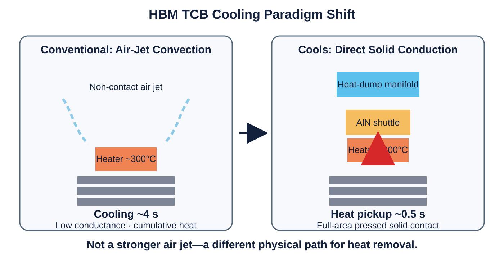
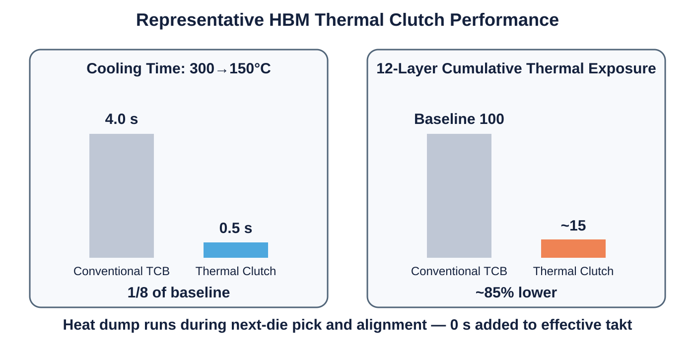

# Cools HBM Thermal Clutch

## From Air-Jet Cooling to Direct Solid Conduction

**0.5-second heat pickup · approximately 85% lower cumulative thermal exposure in a 12-layer model · heat-dump time hidden outside the effective bonding takt**

[한국어](README_KR.md) · [中文](README_ZH.md)

> **HBM bonding does not need a stronger air jet. It needs a different heat-transfer path.**

## Headline performance

| Metric | Conventional TCB | Cools Thermal Clutch |
|---|---:|---:|
| Cooling mechanism | Air jet / convection | Full-area direct solid conduction |
| Cooling time, 300 to 150 °C | about 4 s | about 0.5 s |
| Cumulative equivalent thermal exposure at the lowest pre-bonded joint, 12-layer model | Baseline | approximately 85% lower |
| Heat-dump time added to effective takt | Fully added | 0, hidden during die pick and alignment |
| Additional electrical actuator | — | 0 |
| Utility requirement | Air-based cooling hardware | Existing pressure and house-vacuum lines |

The 0.5-second value and approximately 85% reduction are modeled design results based on the representative geometry and 12-layer thermal analysis in the source technical brief.

## Three-phase thermal-clutch cycle

1. **Heating and standby** — The aluminum nitride (AlN) shuttle is held against the heat-dump manifold by vacuum, leaving an approximately 100 µm vacuum gap above the heater pickup surface.
2. **Cooling pickup** — At the end of heating, positive pressure moves the shuttle into full-area contact with the heater rear surface. Heat is rapidly loaded into the shuttle while bonding pressure and planar constraint are maintained.
3. **Hidden heat dump** — Vacuum returns the heated shuttle to the heat-dump manifold while the next die is picked, aligned, and prepared.

## Why this matters for HBM stacking

As each new die is bonded, heat spreads downward through the stack and reheats joints that were already formed. In an n-layer stack, the lowest joint can experience n-1 repeated thermal exposures. The Thermal Clutch returns the bonded stack toward a defined starting thermal state before the next bonding step and directly targets:

- cumulative intermetallic-compound growth;
- prolonged high-temperature dwell;
- remelting, bridging, and joint-collapse risk;
- warpage during solidification and stiffness recovery;
- loss of process window from 12 layers toward 16 layers and beyond.

## Productivity is more than faster cooling

The central manufacturing advantage is not merely changing a 4-second cooling step into a 0.5-second cooling step. The Thermal Clutch separates **heat pickup** from **heat rejection**. Only rapid pickup remains inside the bonding cycle; the dump process is moved into the parallel die-handling interval.

> **The next HBM productivity breakthrough will come from hiding heat rejection outside the bonding takt.**

## Retrofit architecture

The platform is designed as a rear-side bond-head module rather than a new bonder architecture:

- one AlN shuttle;
- one pressure space and compact heat-dump manifold;
- two utility connections and one valve-control channel;
- no motor, solenoid, piezoelectric stage, or moving electrical harness near the hot zone;
- no change to the core bonding temperature profile, load profile, or underfill concept.

The shuttle is moved by pressure-sign switching using fab utilities such as Clean Dry Air (CDA), nitrogen pressure, and house vacuum.

## Representative design

- heater: 16 × 16 × 1.5 mm;
- AlN shuttle: 12 × 12 × 9.9 mm;
- nominal vacuum gap: 100 µm;
- AlN thermal conductivity: approximately 170 W/(m·K);
- shuttle thermal capacity: approximately 3.4 J/K;
- calculated coupled equilibrium temperature: approximately 119 °C;
- example bond peak and reset temperature: about 300 °C and 150 °C.

These dimensions are a representative embodiment, not the full boundary of the platform.

## Applications

HBM thermocompression bonding, TC-NCF and MR-MUF related flows, die-to-wafer chiplet attach, pre-hybrid-bonding thermal-budget control, and large-area interposer or package-substrate attachment.

## Patent position

Cools positions the HBM Thermal Clutch as an implementation of its selective dual-surface intermediate heat-transfer platform, including selective contact switching, three-phase one-way heat transport, thermal-state reset, hidden heat dumping, pressure-sign switching, equilibrium-point heat-capacity design, and thickness-to-thermal-penetration-depth matching.

Publication of this repository does not grant any licence, implied right, or permission to practise the disclosed technology.

## Intellectual property and transaction options

The technologies, structures, thermal-control sequences, and implementation concepts described in this repository are protected, as applicable, by granted patents, pending patent applications, and proprietary know-how of Cools Inc.

Cools is open to structured discussions with qualified strategic partners. Depending on the application, field, territory, and transaction scope, potential structures may include:

- exclusive or non-exclusive patent licensing;
- field-of-use or territory-limited rights;
- module, process, and architecture transfer with technical support;
- joint development and commercialization;
- strategic investment or transfer of the relevant technology business; and
- where commercially appropriate, assignment or transfer of the relevant patents, patent applications, and associated rights themselves.

**Negotiations are not limited to a licence. Where the transaction purpose and conditions are appropriate, the relevant patent portfolio itself may be included in the transaction.**

Any transaction is subject to technical and legal due diligence and a definitive written agreement.

## Related Cools technology

- [Cools CoWoS No-Warpage Solution](https://github.com/jhcho9494/Cools_CoWos_No_WarpageSolution)

## Contact

**Dr. Jinhyun Cho — Founder & CEO, Cools Inc.**  
Email: [jhcho@cools.co.kr](mailto:jhcho@cools.co.kr)

For technical review, licensing, patent-inclusive transactions, technology transfer, investment, or joint development, please contact Cools Inc.

© 2026 Cools Inc. All rights reserved.