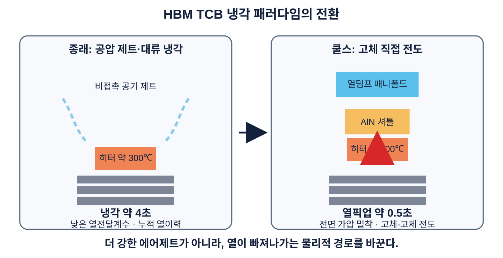
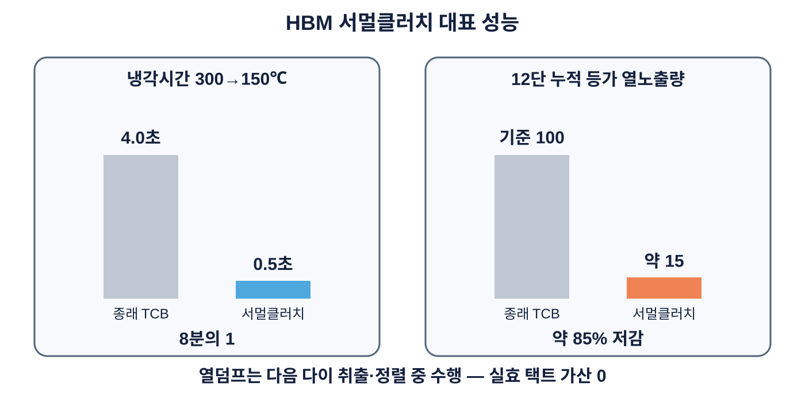

# 쿨스 HBM 서멀클러치

## 공압 제트 냉각에서 고체 직접 전도로의 전환

**0.5초 열픽업 · 12단 모델 최하단 기접합부 누적 등가 열노출량 약 85% 저감 · 열덤프 택트 완전 은닉**

[English](README.md) · [中文](README_ZH.md)

> **HBM 본딩에 필요한 것은 더 강한 에어제트가 아니라, 완전히 다른 열전달 경로이다.**

## 대표 성능

| 항목 | 종래 TCB | 쿨스 서멀클러치 |
|---|---:|---:|
| 냉각 메커니즘 | 공압 제트·대류 | 전면 밀착 고체 전도 |
| 300→150℃ 냉각시간 | 약 4초 | 약 0.5초 |
| 12단 최하단 기접합부 누적 등가 열노출량 | 기준 | 약 85% 저감 |
| 열덤프 시간의 실효 택트 가산 | 전량 가산 | 0 |
| 추가 전기 액추에이터 | — | 0개 |
| 구동 유틸리티 | 공기 냉각계 | 기존 압력·하우스 진공 |

0.5초 및 약 85% 저감 수치는 원 기술자료의 대표 치수와 12단 열해석 모델에 근거한 설계·해석 결과이다.

## 3국면 서멀클러치 사이클

1. **가열·대기** — 질화알루미늄(AlN) 셔틀을 부압으로 열덤프 매니폴드에 흡착하고 히터 열픽업면과 약 100 µm 진공 갭을 유지한다.
2. **냉각 픽업** — 가열 종료와 동시에 양압을 인가해 셔틀을 히터 배면에 전면 밀착시키고, 가압·평탄 구속 상태에서 열을 급속 픽업한다.
3. **열덤프 은닉** — 부압으로 셔틀을 방열부에 복귀시키고, 다음 다이의 취출·정렬·배치 준비 중 축적 열을 방출한다.

## HBM 고단 적층에서의 의미

새 다이를 적층할 때마다 열은 스택 하방으로 확산되어 이미 형성된 하부 접합부를 반복 가열한다. n단 스택에서 최하단 접합부는 n-1회의 반복 열노출을 받을 수 있다. 서멀클러치는 매 적층 단계 전에 접합체를 설정 시작 열상태로 복귀시켜 다음 문제를 직접 제어한다.

- 금속간화합물(Intermetallic Compound, IMC) 과성장
- 고온 체류시간 누적
- 재용융·브리징·접합부 붕괴
- 응고·강성 회복 중 워피지
- 12단에서 16단 이상으로 갈수록 축소되는 공정 윈도우

## 생산성 향상의 본질

핵심은 냉각 4초를 0.5초로 줄이는 데 그치지 않는다. 서멀클러치는 **열픽업**과 **열방출**을 시간적으로 분리한다. 본딩 택트 안에는 0.5초 열픽업만 남기고, 실제 방열은 다음 다이 처리시간으로 이동시킨다.

> **차세대 HBM 생산성의 결정적 전환은 냉각을 빠르게 하는 것이 아니라, 열방출을 본딩 택트 밖으로 숨기는 것이다.**

## 기존 본더 리트로핏

서멀클러치는 신규 본더가 아니라 본드헤드 배면 옵션 모듈이다.

- AlN 셔틀 1매
- 압력공간 및 소형 열덤프 매니폴드
- 배관 2본과 밸브 신호 1채널
- 모터·솔레노이드·압전 스테이지 0개
- 고온부 이동 배선 0개
- 본딩 온도·하중 프로파일 및 언더필 개념 유지

구동은 Clean Dry Air(CDA, 청정건조공기), 질소 압력 및 하우스 진공의 압력 부호 전환으로 수행된다.

## 대표 실치수

- 히터: 16 × 16 × 1.5 mm
- AlN 셔틀: 12 × 12 × 9.9 mm
- 진공 이격 갭: 100 µm
- AlN 열전도도: 약 170 W/(m·K)
- 셔틀 열용량: 약 3.4 J/K
- 열결합계 계산 평형온도: 약 119℃
- 접합 피크·설정 복귀 온도 예시: 약 300℃·150℃

이는 대표 실시구조이며 플랫폼의 전체 권리범위를 한정하지 않는다.

## 적용 분야

HBM 다단 적층 Thermo-Compression Bonding(TCB, 열압착 접합), Thermocompression Non-Conductive Film(TC-NCF), Molded Reflow-Molded Underfill(MR-MUF) 관련 공정, 다이-투-웨이퍼 칩렛 어태치, 하이브리드 본딩 전 열예산 관리 및 대면적 인터포저·패키지 기판 접합.

## 특허 포지션

쿨스는 본 기술을 선택적 양면 밀착형 중간 열전달체 원천 플랫폼의 HBM 구현으로 포지셔닝한다. 가열측-방열측 선택 밀착, 3국면 단방향 열이송, 적층 단계별 열상태 복귀, 열덤프 은닉, 양압·부압 선택 인가, 평형온도 통과점 열용량 설계 및 두께-열침투깊이 정합을 포함한다.

본 저장소의 공개는 어떠한 실시권, 묵시적 권리 또는 기술 사용 허락도 부여하지 않는다.

## 관련 기술

- [Cools CoWoS No-Warpage Solution](https://github.com/jhcho9494/Cools_CoWos_No_WarpageSolution)

## 연락처

**조진현 박사 — ㈜쿨스 대표**  
Email: [jhcho@cools.co.kr](mailto:jhcho@cools.co.kr)

© 2026 Cools Inc. All rights reserved.