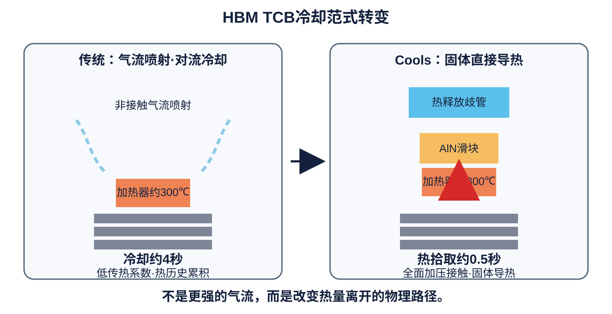
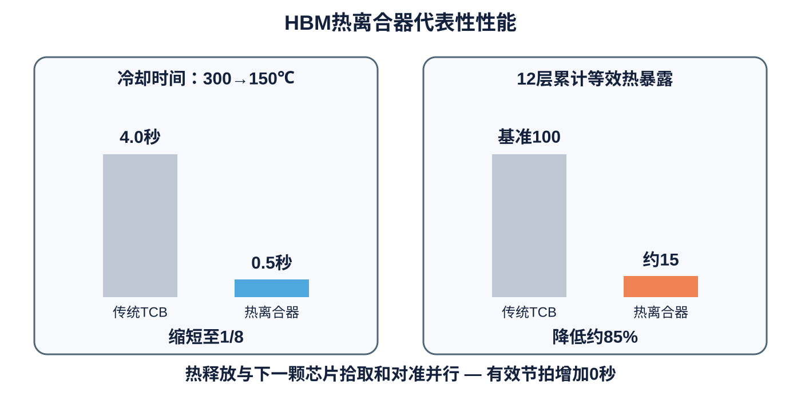
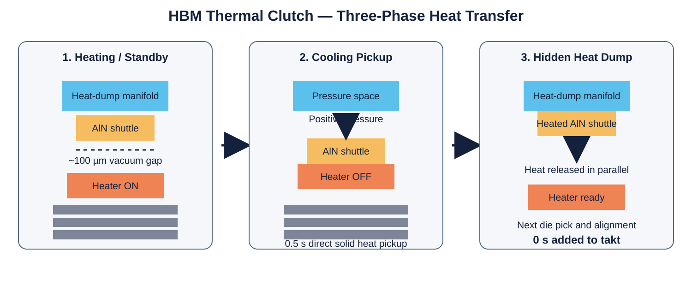

# Cools HBM 热离合器

## 从气流喷射冷却转向固体直接导热

**0.5秒热拾取 · 12层模型中最底层既有焊点累计等效热暴露降低约85% · 热释放时间隐藏于有效节拍之外**

[English](README.md) · [한국어](README_KR.md)

> **HBM键合需要的不是更强的气流，而是完全不同的热传递路径。**

## 代表性性能

| 项目 | 传统TCB | Cools热离合器 |
|---|---:|---:|
| 冷却机制 | 气流喷射/对流 | 全面接触固体导热 |
| 300→150℃冷却时间 | 约4秒 | 约0.5秒 |
| 12层模型最底层既有焊点累计等效热暴露 | 基准 | 约降低85% |
| 热释放时间计入有效节拍 | 全部计入 | 0 |
| 新增电动执行器 | — | 0 |
| 驱动条件 | 气冷系统 | 现有压力与厂务真空 |

上述0.5秒和约85%降低值来自源技术资料中的代表性尺寸设计与12层热分析模型。

## 三阶段热离合循环

1. **加热与待机** — 氮化铝（AlN）滑块通过负压吸附在热释放歧管侧，与加热器热拾取面保持约100 µm真空间隙。
2. **冷却拾取** — 加热结束时施加正压，使滑块全面压接于加热器背面，并在保持键合压力和平面约束的状态下快速吸收热量。
3. **隐藏式热释放** — 负压使已吸热滑块返回散热侧，并在下一颗芯片拾取、对准和准备期间释放热量。

## 对HBM高层堆叠的意义

每增加一层芯片，热量都会向下传播并重复加热已经形成的下层焊点。在n层堆叠中，最底层焊点可能经历n-1次重复热暴露。热离合器在每次键合前将堆叠结构恢复到设定起始热状态，从而直接控制：

- 金属间化合物（Intermetallic Compound, IMC）过度生长；
- 高温停留时间累积；
- 再熔、桥连及焊点塌陷；
- 凝固和刚度恢复期间的翘曲；
- 从12层向16层及更高层数发展时的工艺窗口缩小。

## 生产率提升的本质

关键不只是把冷却时间从4秒缩短到0.5秒。热离合器将**热拾取**与**热释放**在时间上分离。只有快速热拾取留在键合周期内，后续热释放被移入原本就存在的芯片处理并行区间。

> **下一代HBM生产率突破来自把热释放移出键合节拍，而不仅仅是加快冷却。**

## 现有设备改造

该平台被设计为键合头背面模块，而不是全新键合设备。

- 一片AlN滑块；
- 一个压力腔和小型热释放歧管；
- 两条厂务管线和一个阀控制通道；
- 无电机、无电磁铁、无压电平台；
- 高温区无移动电缆；
- 基本键合温度、载荷曲线和底部填充概念保持不变。

滑块通过Clean Dry Air（CDA，清洁干燥空气）、氮气压力和厂务真空的压力符号切换驱动。

## 代表性设计

- 加热器：16 × 16 × 1.5 mm；
- AlN滑块：12 × 12 × 9.9 mm；
- 名义真空间隙：100 µm；
- AlN导热系数：约170 W/(m·K)；
- 滑块热容量：约3.4 J/K；
- 计算耦合平衡温度：约119℃；
- 键合峰值与复位温度示例：约300℃与150℃。

这些尺寸属于代表性实施方式，并不限定平台的完整边界。

## 应用

HBM多层热压键合、TC-NCF与MR-MUF相关流程、芯粒到晶圆贴装、混合键合前热预算管理，以及大面积中介层或封装基板贴装。

## 专利定位

Cools将HBM热离合器定位为选择性双面接触中间传热平台的具体实现，涵盖选择性接触切换、三阶段单向传热、逐层热状态复位、隐藏式热释放、正负压切换、平衡点热容量设计以及厚度与热穿透深度匹配。

本存储库的公开不授予任何许可、默示权利或实施授权。

## 相关Cools技术

- [Cools CoWoS No-Warpage Solution](https://github.com/jhcho9494/Cools_CoWos_No_WarpageSolution)

## 联系方式

**Dr. Jinhyun Cho — Founder & CEO, Cools Inc.**  
Email: [jhcho@cools.co.kr](mailto:jhcho@cools.co.kr)

© 2026 Cools Inc. All rights reserved.